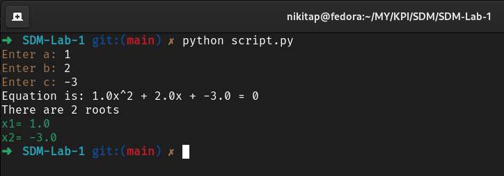
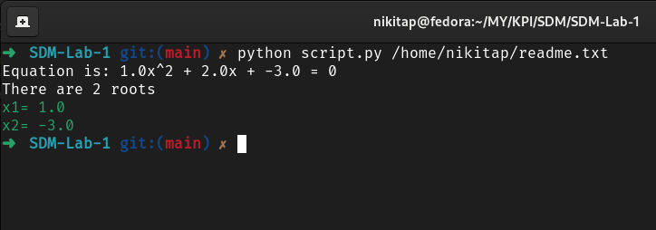
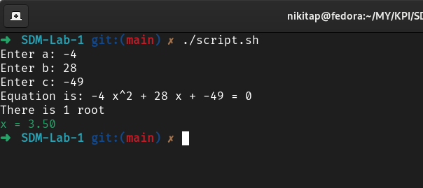
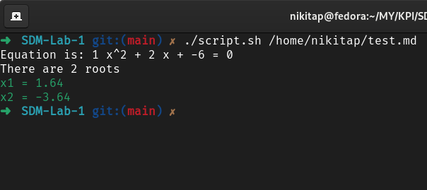

# Console utility for solving quadratic equations

## Description
This utility allows you to solve any quadratic equations and supports 2 modes of operation:
- **Interactive mode.** If no arguments were passed to the utility when it was launched, then the coefficients of the quadratic equation must be entered interactively.

- **Non-interactive (file) mode.** If the path to a file was passed as an argument when starting the utility, then the coefficients of the quadratic equation will be taken from this file.


## Installation
This utility is written in the python programming language. To run it, you need to download python from the [official site](https://www.python.org/) and install it on your computer. (If you're using a Linux distribution, you probably don't need to worry about this).  
If python is installed on your computer, then follow the next few steps:
1. Clone the repository on your computer
```bash
git clone https://github.com/nikitosikvn1/SDM-Lab-1.git
```
2. Go to your local repository folder
```bash
cd SDM-Lab-1/
```
3. Run the utility without arguments (interactively):
```bash
python script.py
```
4. OR pass the path to the file (non-interactively):
```bash
python script.py /path/to/your/file/file.txt
```

P.S This utility does not use third party libraries, so you do not need to install anything other than python.  
P.S.S If you're on a Linux distribution and you're having problems, try using python3 instead of python.

---
## Bash version
The algorithm was rewritten in bash, which allows you to run the script without any problems in any Linux operating system. (This version may not work correctly in some cases, as it has not been tested enough)  
To run the script you just need to run:
1. For interactive mode:
```bash
./script.sh
```
2. For file mode:
```bash
./script.sh /path/to/your/file/file.txt
```

P.S Make sure the file is executable
P.S.S If an error occurs, then you probably do not have bc installed. It is usually installed by default on most Linux distributions, but you can always install it using your package manager.

### Example
- **Interactive mode.**  

- **Non-interactive (file) mode.**  


## File format for non-interactive mode
1. **File extension.** The utility supports any format of text files. Tested with *.txt, *.md, *.rst.
2. **File content.** For the utility to work correctly, you need to specify 3 numbers separated by a space in the first line of the file. If the coefficients are real numbers, a dot is expected as the decimal character.  

*Please note that the file must be created in directories that the current user has access to, otherwise there will be access problems.*

## Revert commit
- Commit name: Revert "docs: Unwanted changes"
- Hash: 57874deafcc4aff029d50d3ef80b04e94d5f1347